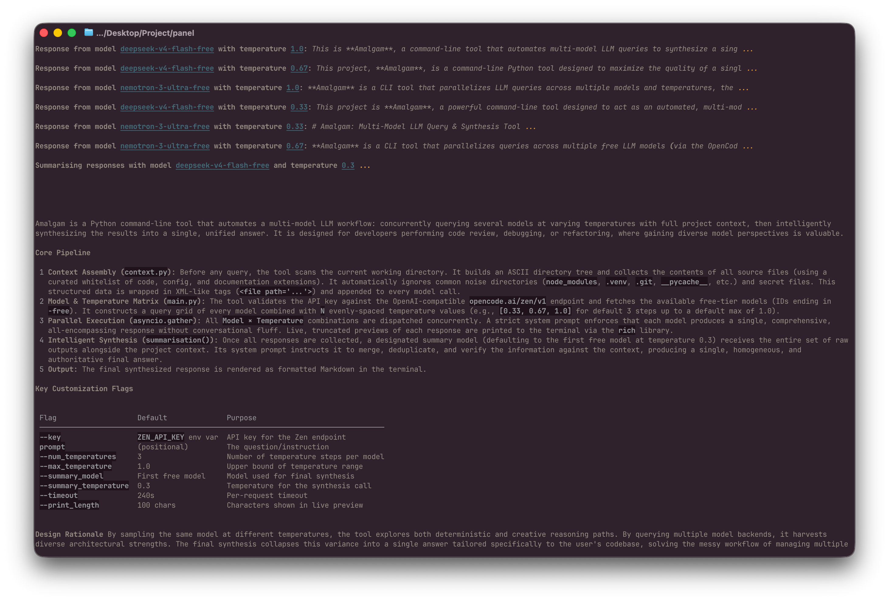

# Amalgam

If you're anything like me, towards the end of your projects, you're always querying multiple (5+) llm models at the same time, hoping to catch the last of the tiny issues, and trying to get the best out of every llm. But having seven opencode instances in numerous ghostty windows is messy, screen-constrained, and for my humble laptop, resource intensive. Amalgam aims to solve this by quering multiple llms at the same time (with multiple instances of the same model at different temperatures) and then merging the results together, giving you the best of all worlds in one place. Highly customisable, with cli flags covering temperatures, number of models, timeout, preview lengths, and more. One can use custom endpoints and models (beyond opencode zen). Enjoy!



## Installation

Requires Python 3.12+.

```bash
pip install amalgam-panel
```

## Usage

```bash
amalgam --key <your key> --timeout 120 --max_temperature 1 'What is life?'
amalgam -h # Check all flags and usage
```

## Providers and keys

As with any llm tool, a provider is required. The default is opencode zen, and you need not specify an endpoint for this default provider. For any other provider, you may pass --endpoint <endpoint> to use a custom endpoint.

Similarly, a key is required. Since the default endpoint is opencode zen, the tool automatically looks for an environment variable called ZEN_API_KEY. If this is not set, one may pass --key <key> to use a custom, runtime-defined key. For any other provider apart from opencode zen, you must pass --key.
